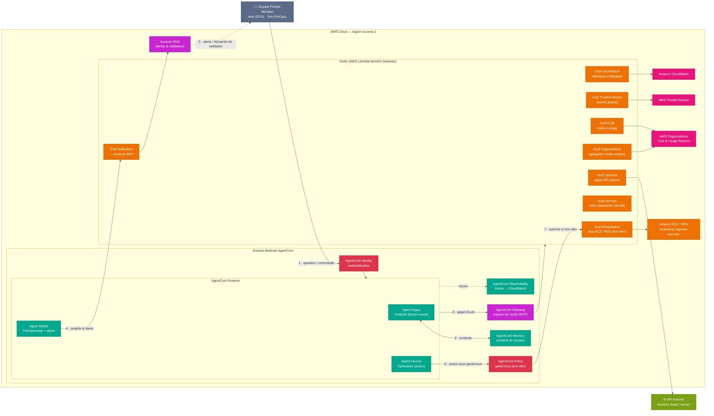

# Boussole FinOps — Architecture

Système **FinOps multi-agents** propulsé par **Amazon Bedrock AgentCore**. Trois agents
forment une boucle **Voir → Anticiper → Agir** et raisonnent sur le **coût total de
possession** (TCO) en agrégeant les coûts AWS multi-comptes **et** les coûts hors-AWS
(on-premise, licences SaaS).

Services et briques principaux : **Amazon Bedrock AgentCore** (Runtime · Gateway · Memory ·
Identity · Observability · Policy) · **AWS Lambda** · **Amazon SNS** · **AWS Organizations /
Cost & Usage Reports** · **Amazon CloudWatch** · **AWS Trusted Advisor** · **API externe de
licences** · **Amazon EC2 / Amazon RDS**.

---

## Diagramme d'architecture (système multi-agents)

---

## Déroulé du système

1. **Équipe → AgentCore Identity** : la requête (question FinOps ou commande d'optimisation)
   est authentifiée avant tout traitement.
2. **Argus ↔ AgentCore Memory** : l'agent analyste conserve le contexte de la conversation
   pendant la session.
3. **Runtime → Gateway → Outils** : les agents n'accèdent **jamais** directement aux sources ;
   ils invoquent les **outils** exposés via Gateway (CloudWatch, Trusted Advisor, CUR,
   Organizations, Licences, OnPrem, Notification, Remediation).
4. **Sibylle → Outil Notification** : l'agent prévisionniste projette la dépense de fin de
   mois, la compare au budget et **émet une alerte** en cas de dérive.
5. **SNS → Équipe** : l'alerte (et, pour Faucon, la **demande de validation humaine**) est
   transmise à l'équipe.
6. **Faucon → AgentCore Policy** : avant toute action destructrice, l'agent optimiseur passe
   par la couche **Policy**.
7. **Policy → Outil Remediation** : l'action n'est autorisée que si la ressource porte le tag
   `env=dev` ; l'outil arrête alors l'instance EC2/RDS. Toutes les exécutions sont **tracées**
   par AgentCore Observability dans CloudWatch.

---

## Les trois agents (boucle Voir → Anticiper → Agir)

| Agent | Rôle | Nature | Outils principaux |
|---|---|---|---|
| **Argus** | Analyste | Lecture seule | CloudWatch, Trusted Advisor, CUR, Organizations, Licences, OnPrem |
| **Sibylle** | Prévisionniste & alerte | Lecture + notification | CUR, Organizations, Notification (SNS) |
| **Faucon** | Optimiseur | Action sous garde-fous | Remediation (stop EC2/RDS `env=dev`), Notification |

---

## Légende des couleurs (catégories AWS)

| Couleur | Catégorie | Éléments |
|---|---|---|
| 🟢 Vert d'eau | Machine Learning / AI | Agents (Argus, Sibylle, Faucon), AgentCore Memory & Observability |
| 🟠 Orange | Compute | AWS Lambda (outils), Amazon EC2 / RDS |
| 🟪 Magenta | Application Integration | AgentCore Gateway, Amazon SNS |
| 🔴 Rouge | Sécurité, identité & conformité | AgentCore Identity, AgentCore Policy |
| 🩷 Rose | Management & Governance | AWS Organizations / CUR, CloudWatch, Trusted Advisor |
| 🟩 Vert | Hors-AWS | API externe de licences SaaS |
| ⚪ Gris | Client | Équipe FinOps de Méridian |

> Les flèches **pleines** représentent le flux principal (requête → outils → action).
> Les flèches **pointillées** représentent les flux de **notification** et de **traçabilité**.
